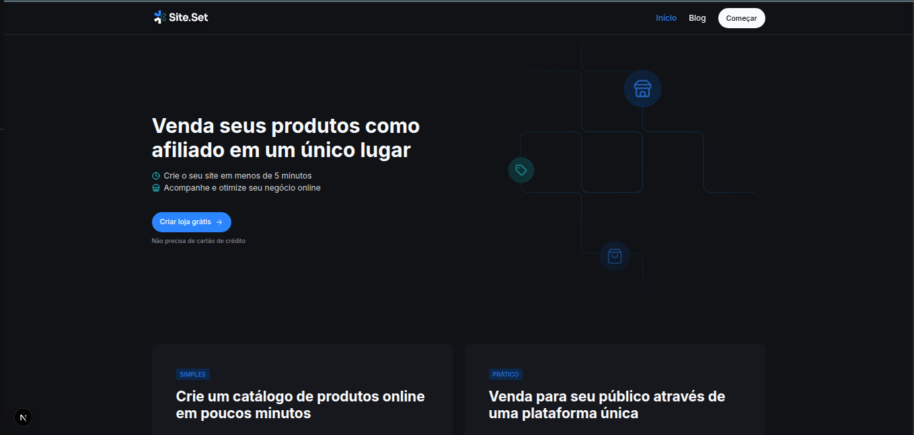
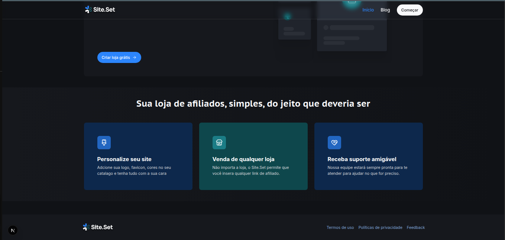

# Blog App

Aplicação de blog moderna desenvolvida com Next.js, TypeScript e Styled Components.

## Sobre a Aplicação

Um blog pessoal elegante e responsivo, permitindo a criação, edição e publicação de artigos. O projeto foi desenvolvido com foco em performance, design moderno e uma ótima experiência do usuário.

## Funcionalidades

- Visualização de posts em um layout grid responsivo
- Detalhe de cada post com conteúdo formatado
- Categorização de artigos
- Design moderno com tema claro
- Totalmente responsivo para mobile e desktop

## Tecnologias

- **Next.js** - Framework React com SSR
- **TypeScript** - Tipagem estática
- **Styled Components** - Estilização CSS-in-JS
- **React Hooks** - Gerenciamento de estado

## Screenshots

### Página Principal (Hero)


### Rodapé


## Como Executar

```bash
# Instalar dependências
npm install

# Iniciar servidor de desenvolvimento
npm run dev

# Executar em produção
npm run build
npm start
```

O servidor estará disponível em [http://localhost:3000](http://localhost:3000)

## Estrutura do Projeto

```
blog-app/
├── public/img/          # Imagens e assets
├── src/
│   ├── pages/          # Rotas e páginas
│   ├── components/     # Componentes React
│   └── styles/         # Estilos globais
└── README.md
```
